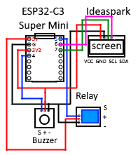

# ESP32-C3 controller

## Used for:
- Controlling bluetooth LED
- Controlling relay
- Controlling buzzer

## Used components:
- ESP32-C3 Super Mini
- JQC-3FF-S-Z (5VDC / 10A/250VAC 15A/125VAC / 10A 250VAC) relay
- Simple buzzer with 3 pins
- Ideaspark (SSD1306) 128x64 screen with 4 pins

## Used software and techiques
- Arduino CLI / C++
- Android Studio / Kotlin

## Wiring

## Video
